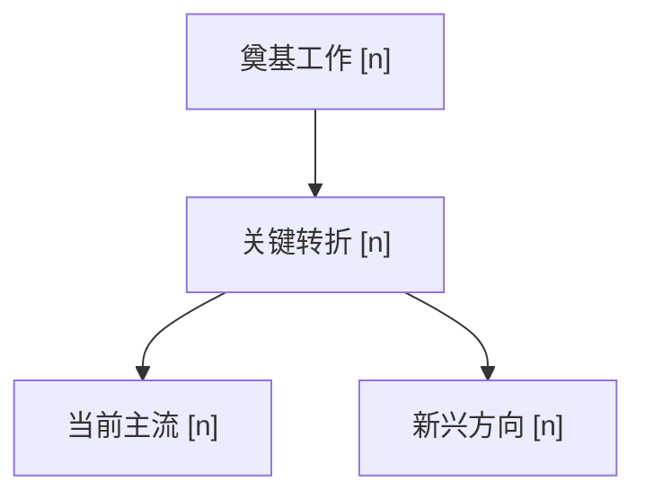

# lusca-paper-search 输出体系重构（v2.0.0）实现计划

> **For agentic workers:** REQUIRED SUB-SKILL: Use superpowers:subagent-driven-development (recommended) or superpowers:executing-plans to implement this plan task-by-task. Steps use checkbox (`- [ ]`) syntax for tracking.

**Goal:** 把 `lusca-paper-search` 的输出从「分来源多表 + 七节摘要」重构为「研究导览（AI）+ 完整索引（脚本直出）」二段式，脚本聚合器改为返回扁平 `list[paper]` 并直出合并 markdown 表格。

**Architecture:** `search_papers.py` 的聚合器在去重后新增 `_flatten_and_sort` 扁平化 + 排序；CLI 一次输出 `===DATA===`(JSON，含 abstract/citation_count 供 AI 分析) 与 `===TABLE===`(7 列合并表，供 AI 原样贴报告) 两段，顺序一致以保证序号闭环；公开 `search_papers()` 返回扁平 `list[paper]`（breaking）。SKILL.md 指导 AI：用 DATA 段写「发展脉络 / 研究热点 / 推荐阅读」三节导览，原样贴 TABLE，model_knowledge 改为附录。

**Tech Stack:** Python 3.10+、pytest 9.1.1、markdown。

**依据 spec：** `docs/superpowers/specs/2026-07-15-lusca-paper-search-output-v2-design.md`

**约定：**
- 所有路径相对仓库根 `/code/project/paper/skills/lusca-skill`。
- 测试从仓库根运行：`python -m pytest skills/lusca-paper-search/scripts/test_search_papers.py -v`。
- 各源脚本（`search_papers_by_*.py`）、`_dedup_cross_source`、`_extract_code_links`、`_filter_by_date_range` 全程不动。
- commit 由执行阶段控制；仓库当前在 `main`，沿用仓库习惯直接提交（如需可先开分支）。

**新增/改动文件清单：**

| 文件 | 动作 | 责任 |
|------|------|------|
| `skills/lusca-paper-search/scripts/search_papers.py` | 改 | 扁平化、表格/JSON 渲染、CLI 两段输出、函数返回值 |
| `skills/lusca-paper-search/scripts/test_search_papers.py` | 新建 | 聚合/渲染的单元测试 |
| `skills/lusca-paper-search/references/programmatic_api.md` | 改 | 返回值改 `list[paper]` |
| `skills/lusca-paper-search/SKILL.md` | 改 | 输出规范重写、`version: 2.0.0` |
| `skills/lusca-paper-search/assets/report-template.md` | 改 | 新二段式骨架 |
| `skills/lusca-paper-search/CHANGELOG.md` | 改 | 2.0.0 条目 |

---

## Task 1：新增 `_flatten_and_sort`（扁平化 + 排序）

**Files:**
- Modify: `skills/lusca-paper-search/scripts/search_papers.py`（在 `_dedup_cross_source` 之后、`search_papers` 之前插入）
- Test: `skills/lusca-paper-search/scripts/test_search_papers.py`（新建）

- [ ] **Step 1：新建测试文件并写失败测试**

创建 `skills/lusca-paper-search/scripts/test_search_papers.py`：

```python
"""单元测试：lusca-paper-search 聚合器（扁平化 / 排序 / 渲染）。

只测纯逻辑（不触发真实 API）。从仓库根运行：
    python -m pytest skills/lusca-paper-search/scripts/test_search_papers.py -v
"""
import os
import sys

# 让 `from search_papers import ...` 在任意 cwd 下可用
sys.path.insert(0, os.path.dirname(os.path.abspath(__file__)))


from search_papers import _flatten_and_sort, _source_rank


def test_source_rank_follows_canonical_order():
    # 规范顺序：semantic_scholar → open_alex → arxiv → openreview → crossref → dblp → deepxiv → sciverse
    assert _source_rank("semantic_scholar") < _source_rank("open_alex")
    assert _source_rank("open_alex") < _source_rank("arxiv")
    assert _source_rank("arxiv") < _source_rank("openreview")
    assert _source_rank("dblp") < _source_rank("sciverse")
    # 未知来源排所有已知来源之后
    assert _source_rank("sciverse") < _source_rank("unknown_source")


def test_flatten_sorts_by_source_order_then_date_desc():
    deduped = {
        "arxiv": [
            {"title": "Older", "publication_date": "2024-01-01", "source": "arxiv"},
            {"title": "Newer", "publication_date": "2025-05-01", "source": "arxiv"},
        ],
        "semantic_scholar": [
            {"title": "S2Paper", "publication_date": "2024-06-01", "source": "semantic_scholar"},
        ],
    }
    flat = _flatten_and_sort(deduped)
    titles = [p["title"] for p in flat]
    # semantic_scholar 组先（规范顺序），arxiv 组后；arxiv 组内 date 降序 Newer>Older
    assert titles == ["S2Paper", "Newer", "Older"]


def test_flatten_paper_without_date_goes_last_in_group():
    deduped = {
        "arxiv": [
            {"title": "NoDate", "publication_date": "", "source": "arxiv"},
            {"title": "HasDate", "publication_date": "2023-03-03", "source": "arxiv"},
        ],
    }
    flat = _flatten_and_sort(deduped)
    assert [p["title"] for p in flat] == ["HasDate", "NoDate"]
```

- [ ] **Step 2：运行测试验证失败**

Run: `python -m pytest skills/lusca-paper-search/scripts/test_search_papers.py -v`
Expected: FAIL，`ImportError: cannot import name '_flatten_and_sort'`

- [ ] **Step 3：实现 `_flatten_and_sort` 与 `_source_rank`**

在 `search_papers.py` 中，`_dedup_cross_source` 函数结束后（约第 171 行之后）插入：

```python
# --- 扁平化与全局排序 ---------------------------------------------------------

# 规范顺序（信号由高到低）：跨源去重后的全部论文按此顺序归并，组内按日期降序。
_SOURCE_ORDER = [
    "semantic_scholar", "open_alex", "arxiv", "openreview",
    "crossref", "dblp", "deepxiv", "sciverse",
]


def _source_rank(source: str) -> int:
    """来源在规范顺序中的位置；未知来源排所有已知来源之后（保持稳定）。"""
    try:
        return _SOURCE_ORDER.index(source)
    except ValueError:
        return len(_SOURCE_ORDER)


def _flatten_and_sort(deduped_results: dict[str, list[dict]]) -> list[dict]:
    """把跨源去重后的 {source: [papers]} 扁平化为单一列表。

    排序：source 规范顺序（_SOURCE_ORDER），组内 publication_date 降序（新优先）。
    无 publication_date 者排组末（空串最小、reverse 后沉底）。"""
    flat: list[dict] = []
    for source in sorted(deduped_results, key=_source_rank):
        ordered = sorted(
            deduped_results[source],
            key=lambda p: p.get("publication_date") or "",
            reverse=True,
        )
        flat.extend(ordered)
    return flat
```

- [ ] **Step 4：运行测试验证通过**

Run: `python -m pytest skills/lusca-paper-search/scripts/test_search_papers.py -v`
Expected: PASS（3 个测试）

- [ ] **Step 5：提交**

```bash
git add skills/lusca-paper-search/scripts/search_papers.py skills/lusca-paper-search/scripts/test_search_papers.py
git commit -m "refactor(search): add _flatten_and_sort for merged single-list ordering"
```

---

## Task 2：新增合并 markdown 表格渲染

**Files:**
- Modify: `skills/lusca-paper-search/scripts/search_papers.py`（在 `_flatten_and_sort` 之后插入渲染函数）
- Test: `skills/lusca-paper-search/scripts/test_search_papers.py`（追加测试）

- [ ] **Step 1：追加失败测试**

在 `test_search_papers.py` 末尾追加：

```python
from search_papers import _render_markdown_table


def test_table_header_is_seven_columns():
    lines = _render_markdown_table([]).splitlines()
    assert lines[0] == "| # | Title | Author | Date | Venue | Code/Resource | Source |"
    assert lines[1] == "|---|-------|--------|------|-------|---------------|--------|"


def test_table_row_formats_all_fields():
    papers = [{
        "title": "Great Paper",
        "authors": ["Alice", "Bob", "Carol", "Dan"],
        "publication_date": "2024-03-15",
        "venue": "NeurIPS",
        "url": "https://arxiv.org/abs/2401.00001",
        "code_links": ["https://github.com/x/y", "https://huggingface.co/z"],
        "sources": ["arxiv", "semantic_scholar"],
    }]
    row = _render_markdown_table(papers).splitlines()[2]
    assert row.startswith("| 1 |")
    assert "[Great Paper](https://arxiv.org/abs/2401.00001)" in row
    assert "Alice, Bob, Carol et al." in row
    assert "2024-03" in row
    assert "NeurIPS" in row
    assert "[code](https://github.com/x/y)" in row
    assert "[model](https://huggingface.co/z)" in row
    assert "arxiv, semantic_scholar" in row


def test_table_empty_fields_show_dash_and_fallback_source():
    papers = [{
        "title": "Bare",
        "authors": [],
        "publication_date": "",
        "year": None,
        "venue": "",
        "url": "",
        "code_links": [],
        "sources": [],
        "source": "dblp",
    }]
    row = _render_markdown_table(papers).splitlines()[2]
    # author / date / venue / code 均空 → 至少 3 个 em-dash（U+2014）占位
    assert row.count("—") >= 3
    # 无 url → 纯文本标题，不渲染 markdown 链接
    assert "[Bare]" not in row
    # sources 空 → 回退到 source 字段
    assert "dblp" in row
```

> 说明：空值占位用 Unicode 长破折号 `—`（U+2014）；第三个测试断言 author/date/venue/code 至少出现 3 次。

- [ ] **Step 2：运行测试验证失败**

Run: `python -m pytest skills/lusca-paper-search/scripts/test_search_papers.py -v`
Expected: FAIL，`ImportError: cannot import name '_render_markdown_table'`

- [ ] **Step 3：实现表格渲染**

在 `search_papers.py` 的 `_flatten_and_sort` 之后插入：

```python
# --- 合并 markdown 表格渲染 ---------------------------------------------------

def _md_cell(text: str) -> str:
    """转义会破坏 markdown 表格结构的管道符。"""
    return (text or "").replace("|", "\\|")


def _format_authors(authors: list[str]) -> str:
    if not authors:
        return "—"
    if len(authors) <= 3:
        return _md_cell(", ".join(authors))
    return _md_cell(", ".join(authors[:3])) + " et al."


def _format_date(paper: dict) -> str:
    d = paper.get("publication_date") or ""
    if d:
        return d[:7]  # YYYY-MM
    y = paper.get("year")
    return str(y) if y else "—"


def _code_label(url: str) -> str:
    u = url.lower()
    if "huggingface.co" in u or "hf.co" in u:
        return "model"
    return "code"


def _format_code_links(links: list[str]) -> str:
    if not links:
        return "—"
    return " ".join(f"[{_code_label(u)}]({u})" for u in links)


def _format_sources(paper: dict) -> str:
    sources = paper.get("sources") or []
    if not sources:
        return _md_cell(paper.get("source") or "unknown")
    return _md_cell(", ".join(sources))


def _format_title(paper: dict) -> str:
    title = (paper.get("title") or "").strip() or "(untitled)"
    url = (paper.get("url") or "").strip()
    if url:
        return f"[{_md_cell(title)}]({url})"
    return _md_cell(title)


def _format_venue(paper: dict) -> str:
    v = paper.get("venue") or ""
    return _md_cell(v) if v else "—"


def _render_markdown_table(papers: list[dict]) -> str:
    """渲染合并后的单一 markdown 表格（7 列），序号 1..N 与列表下标一致。"""
    lines = [
        "| # | Title | Author | Date | Venue | Code/Resource | Source |",
        "|---|-------|--------|------|-------|---------------|--------|",
    ]
    for i, p in enumerate(papers, 1):
        lines.append(
            f"| {i} | {_format_title(p)} | {_format_authors(p.get('authors') or [])} "
            f"| {_format_date(p)} | {_format_venue(p)} "
            f"| {_format_code_links(p.get('code_links') or [])} "
            f"| {_format_sources(p)} |"
        )
    return "\n".join(lines)
```

- [ ] **Step 4：运行测试验证通过**

Run: `python -m pytest skills/lusca-paper-search/scripts/test_search_papers.py -v`
Expected: PASS（6 个测试）

- [ ] **Step 5：提交**

```bash
git add skills/lusca-paper-search/scripts/search_papers.py skills/lusca-paper-search/scripts/test_search_papers.py
git commit -m "feat(search): add merged markdown table renderer (7 columns)"
```

---

## Task 3：新增 JSON 数据 + CLI 输出格式化

**Files:**
- Modify: `skills/lusca-paper-search/scripts/search_papers.py`（在表格渲染之后插入）
- Test: `skills/lusca-paper-search/scripts/test_search_papers.py`（追加测试）

- [ ] **Step 1：追加失败测试**

在 `test_search_papers.py` 末尾追加：

```python
import json
from search_papers import _render_data_json, _format_cli_output


def test_data_json_is_valid_array_preserving_full_fields():
    papers = [{
        "title": "X", "abstract": "long abstract text", "citation_count": 5,
        "authors": ["A"], "year": 2024, "publication_date": "2024-01-01",
        "venue": "V", "url": "u", "source": "arxiv",
        "sources": ["arxiv"], "code_links": [],
    }]
    data = json.loads(_render_data_json(papers))
    assert isinstance(data, list) and len(data) == 1
    assert data[0]["abstract"] == "long abstract text"
    assert data[0]["citation_count"] == 5


def test_cli_output_has_data_then_table_in_same_order():
    papers = [
        {"title": "First", "authors": [], "publication_date": "2024-01-01",
         "venue": "", "url": "u1", "source": "arxiv", "sources": ["arxiv"], "code_links": []},
        {"title": "Second", "authors": [], "publication_date": "2023-01-01",
         "venue": "", "url": "u2", "source": "arxiv", "sources": ["arxiv"], "code_links": []},
    ]
    out = _format_cli_output(papers, total_before=5, k_sources=2)
    assert out.startswith("===DATA===")
    assert "===TABLE===" in out
    data_part, table_part = out.split("===TABLE===")
    # DATA 段顺序与 TABLE 行顺序一致：First 在前 → 表格第 1 行
    assert data_part.index("First") < data_part.index("Second")
    assert "| 1 |" in table_part
    assert "Total: 2 unique papers (5 hits before dedup) from 2 sources." in out
```

- [ ] **Step 2：运行测试验证失败**

Run: `python -m pytest skills/lusca-paper-search/scripts/test_search_papers.py -v`
Expected: FAIL，`ImportError: cannot import name '_render_data_json'`

- [ ] **Step 3：实现 JSON 渲染与 CLI 输出格式化**

在 `search_papers.py` 顶部 import 区（`import re` 同区）加：

```python
import json
```

在 `_render_markdown_table` 之后插入：

```python
def _render_data_json(papers: list[dict]) -> str:
    """渲染扁平 JSON 数组，保留全字段（含 abstract / citation_count）供 AI 分析。"""
    return json.dumps(papers, ensure_ascii=False, indent=2)


def _format_cli_output(papers: list[dict], total_before: int, k_sources: int) -> str:
    """组装 CLI 两段输出：DATA(JSON) + TABLE(markdown) + Total 行。

    DATA 段顺序与 TABLE 行序一致 → 序号 = DATA 下标 + 1（导览↔索引闭环）。"""
    data = _render_data_json(papers)
    table = _render_markdown_table(papers)
    m = len(papers)
    return (
        f"===DATA===\n{data}\n\n"
        f"===TABLE===\n{table}\n\n"
        f"Total: {m} unique papers ({total_before} hits before dedup) from {k_sources} sources."
    )
```

- [ ] **Step 4：运行测试验证通过**

Run: `python -m pytest skills/lusca-paper-search/scripts/test_search_papers.py -v`
Expected: PASS（8 个测试）

- [ ] **Step 5：提交**

```bash
git add skills/lusca-paper-search/scripts/search_papers.py skills/lusca-paper-search/scripts/test_search_papers.py
git commit -m "feat(search): add JSON data + CLI two-section output formatting"
```

---

## Task 4：重构聚合器，`search_papers()` 返回扁平 list

**Files:**
- Modify: `skills/lusca-paper-search/scripts/search_papers.py`（`search_papers` 函数体，约第 173–247 行）
- Test: `skills/lusca-paper-search/scripts/test_search_papers.py`（追加测试）

- [ ] **Step 1：追加失败测试**

在 `test_search_papers.py` 末尾追加：

```python
import search_papers as sp


def test_search_papers_returns_flat_list(monkeypatch):
    fake = [{"title": "P", "source": "arxiv"}]
    monkeypatch.setattr(
        sp, "_search_and_aggregate",
        lambda **kw: (fake, 1, 1),
    )
    result = sp.search_papers(query="q", start_year=2024, end_year=2025)
    assert isinstance(result, list)
    assert result == fake


def test_aggregate_dedups_flattens_and_counts(monkeypatch):
    # 伪造两个来源：arxiv 2 条（含 1 条与 semantic_scholar 标题重复）、s2 1 条（更全）
    def fake_loader(source):
        if source == "arxiv":
            return lambda q, sy, ey, m: [
                {"title": "Dup", "source": "arxiv", "publication_date": "2024-01-01"},
                {"title": "OnlyArxiv", "source": "arxiv", "publication_date": "2024-06-01"},
            ]
        return lambda q, sy, ey, m: [
            {"title": "Dup", "source": "semantic_scholar",
             "publication_date": "2024-01-01", "abstract": "fuller record"},
        ]
    monkeypatch.setattr(sp, "_load_source_func", fake_loader)
    flat, total_before, k = sp._search_and_aggregate(
        query="q", start_year=2024, end_year=2025, max_results=5,
        sources=["arxiv", "semantic_scholar"], parallel=False,
    )
    # 去重前 3 条（arxiv 2 + s2 1）
    assert total_before == 3
    assert k == 2  # 两个来源都有命中
    # 去重后 2 条（Dup 合并）
    assert len(flat) == 2
    # Dup 主来源 = 信息更全的 semantic_scholar（规范顺序在前）→ 排首位
    assert flat[0]["title"] == "Dup"
    assert set(flat[0]["sources"]) == {"arxiv", "semantic_scholar"}
    assert flat[1]["title"] == "OnlyArxiv"
```

- [ ] **Step 2：运行测试验证失败**

Run: `python -m pytest skills/lusca-paper-search/scripts/test_search_papers.py -v`
Expected: FAIL，`AttributeError: module 'search_papers' has no attribute '_search_and_aggregate'`

- [ ] **Step 3：重构为 `_search_and_aggregate` + 薄包装 `search_papers`**

把 `search_papers.py` 中现有的整个 `search_papers(...)` 函数（从 `def search_papers(` 到其 `return results` 结束，约第 173–247 行）替换为下面两个函数：

```python
def _search_and_aggregate(
    query: str,
    start_year: int,
    end_year: int,
    max_results: int = 10,
    sources: Optional[list[str]] = None,
    parallel: bool = True,
    start_date: Optional[str] = None,
    end_date: Optional[str] = None,
) -> tuple[list[dict], int, int]:
    """跑全部来源 → 日期过滤 → 跨源去重 → 扁平排序。

    Returns:
        (flat_papers, total_before_dedup, k_sources_with_hits)
        - flat_papers：去重 + 排序后的扁平 list[dict]
        - total_before_dedup：日期窗口内、去重前的命中总数
        - k_sources_with_hits：返回 >0 条的来源数
    """
    sources = sources or ALL_SOURCES
    invalid = set(sources) - set(ALL_SOURCES)
    if invalid:
        raise ValueError(f"Unknown sources: {invalid}. Valid: {ALL_SOURCES}")

    start_d = _parse_date(start_date, "start_date")
    end_d = _parse_date(end_date, "end_date")
    if start_d and end_d and start_d > end_d:
        raise ValueError(f"start_date {start_d} is after end_date {end_d}")

    results: dict[str, list[dict]] = {}

    def _search(source: str) -> tuple[str, list[dict]]:
        try:
            func = _load_source_func(source)
        except Exception as e:
            print(f"[{source}] unavailable (import failed: {e}); skipping this source.")
            return source, []
        try:
            papers = func(query, start_year, end_year, max_results)
        except Exception as e:
            print(f"[{source}] Error: {e}")
            papers = []
        return source, papers

    if parallel:
        with concurrent.futures.ThreadPoolExecutor(max_workers=len(sources)) as executor:
            futures = {executor.submit(_search, s): s for s in sources}
            for future in concurrent.futures.as_completed(futures):
                source, papers = future.result()
                results[source] = papers
    else:
        for source in sources:
            _, papers = _search(source)
            results[source] = papers

    if start_d or end_d:
        results = {s: _filter_by_date_range(ps, start_d, end_d) for s, ps in results.items()}

    total_before = sum(len(v) for v in results.values())
    k_sources = sum(1 for v in results.values() if v)

    deduped = _dedup_cross_source(results)        # 跨源去重 + code_links 提取
    flat = _flatten_and_sort(deduped)             # 扁平化 + 规范排序
    return flat, total_before, k_sources


def search_papers(
    query: str,
    start_year: int,
    end_year: int,
    max_results: int = 10,
    sources: Optional[list[str]] = None,
    parallel: bool = True,
    start_date: Optional[str] = None,
    end_date: Optional[str] = None,
) -> list[dict]:
    """Search across multiple academic sources and return a flat, deduped, ordered list.

    Args: 同旧行为（query / start_year / end_year / max_results / sources /
        parallel / start_date / end_date）。

    Returns:
        扁平 list[dict]，跨源去重后按 source 规范顺序、组内日期降序排列。
        每个 paper dict 含：title, authors, year, abstract, url, venue,
        citation_count, publication_date, source, sources, code_links。
    """
    flat, _, _ = _search_and_aggregate(
        query=query, start_year=start_year, end_year=end_year,
        max_results=max_results, sources=sources, parallel=parallel,
        start_date=start_date, end_date=end_date,
    )
    return flat
```

- [ ] **Step 4：运行测试验证通过**

Run: `python -m pytest skills/lusca-paper-search/scripts/test_search_papers.py -v`
Expected: PASS（10 个测试）

- [ ] **Step 5：提交**

```bash
git add skills/lusca-paper-search/scripts/search_papers.py skills/lusca-paper-search/scripts/test_search_papers.py
git commit -m "refactor(search): return flat list from search_papers via _search_and_aggregate"
```

---

## Task 5：重写 CLI `__main__` 为两段输出

**Files:**
- Modify: `skills/lusca-paper-search/scripts/search_papers.py`（`if __name__ == "__main__":` 块，约第 250–310 行）

- [ ] **Step 1：替换 `__main__` 块**

把 `search_papers.py` 末尾从 `if __name__ == "__main__":` 起到文件尾（含旧的分来源打印逻辑）整体替换为：

```python
if __name__ == "__main__":
    parser = argparse.ArgumentParser(
        description="Search papers across multiple academic sources",
    )
    parser.add_argument("--query", required=True, help="Search query")
    parser.add_argument("--start-year", type=int, required=True, help="Start year")
    parser.add_argument("--end-year", type=int, required=True, help="End year")
    parser.add_argument(
        "--max-papers", type=int, default=10,
        help="Max number of papers per source (default: 10)",
    )
    parser.add_argument(
        "--sources", nargs="+", default=None,
        choices=ALL_SOURCES,
        help=f"Sources to search (default: all). Choices: {', '.join(ALL_SOURCES)}",
    )
    parser.add_argument(
        "--no-parallel", action="store_true",
        help="Disable parallel querying of sources",
    )
    parser.add_argument(
        "--start-date", default=None,
        help="Optional YYYY-MM-DD lower bound; applied as a post-filter (finer than --start-year)",
    )
    parser.add_argument(
        "--end-date", default=None,
        help="Optional YYYY-MM-DD inclusive upper bound; applied as a post-filter",
    )
    args = parser.parse_args()

    flat, total_before, k_sources = _search_and_aggregate(
        query=args.query,
        start_year=args.start_year,
        end_year=args.end_year,
        max_results=args.max_papers,
        sources=args.sources,
        parallel=not args.no_parallel,
        start_date=args.start_date,
        end_date=args.end_date,
    )
    print(_format_cli_output(flat, total_before, k_sources))

# Example usage:
# python search_papers.py --query "data efficacy for LM training" --start-year 2024 --end-year 2026 --max-papers 20
# python search_papers.py --query "transformers" --start-year 2023 --end-year 2025 --sources arxiv semantic_scholar
```

- [ ] **Step 2：确认 CLI 参数与帮助正常**

Run: `python skills/lusca-paper-search/scripts/search_papers.py --help`
Expected: 打印帮助，含 `--query` / `--start-year` / `--end-year` / `--max-papers` / `--sources` / `--no-parallel` / `--start-date` / `--end-date`，无报错。

- [ ] **Step 3：跑全部单元测试确认无回归**

Run: `python -m pytest skills/lusca-paper-search/scripts/test_search_papers.py -v`
Expected: PASS（10 个测试）

- [ ] **Step 4：提交**

```bash
git add skills/lusca-paper-search/scripts/search_papers.py
git commit -m "feat(search): rewrite CLI to output DATA+TABLE two sections"
```

---

## Task 6：更新 `programmatic_api.md`（返回值改扁平 list）

**Files:**
- Modify: `skills/lusca-paper-search/references/programmatic_api.md`（整文件）

- [ ] **Step 1：用以下内容整体替换文件**

```markdown
# Programmatic API

Most use cases are best served by the CLI in `scripts/search_papers.py` (which
prints a `===DATA===` JSON block plus a `===TABLE===` markdown block). Reach for
the function-call interface only when you need to consume the structured list
directly.

```bash
cd scripts && python -c "
from search_papers import search_papers
papers = search_papers(
    query='<QUERY>',
    start_year=2024,
    end_year=2026,
    max_results=10,
    sources=['semantic_scholar', 'open_alex', 'arxiv', 'openreview'],
    parallel=True,
)
print(len(papers), 'papers')
for p in papers:
    print(f'  - {p[\"title\"]} ({p[\"year\"]})')
"
```

`search_papers()` returns a **flat `list[dict]`**: cross-source deduped and
ordered by source canonical order, then by `publication_date` descending within
each source. Each paper dict contains: `title`, `authors`, `year`, `abstract`,
`url`, `venue`, `citation_count`, `publication_date`, `source`, `sources`
(all sources that matched this paper), `code_links` (GitHub/HuggingFace/etc.
extracted from the abstract).

For the pre-dedup hit count and number of sources with hits, use the internal
`_search_and_aggregate(...)` which returns `(flat_papers, total_before_dedup,
k_sources_with_hits)`.
```

- [ ] **Step 2：提交**

```bash
git add skills/lusca-paper-search/references/programmatic_api.md
git commit -m "docs(search): update programmatic API to flat list return"
```

---

## Task 7：重写 `SKILL.md` 输出规范（v2.0.0）

**Files:**
- Modify: `skills/lusca-paper-search/SKILL.md`

> 依据 spec 第三、四、五节。本任务改动正文多处，frontmatter 升版本。

- [ ] **Step 1：frontmatter 升版本**

把 `version: "1.1.2"` 改为 `version: "2.0.0"`。

- [ ] **Step 2：改写「核心理念」段（约第 16–21 行）**

把
```
通过 `${SKILL_DIR}/scripts/search_papers.py` 在 **arXiv / DBLP / OpenAlex /
OpenReview（NeurIPS/ICLR/ICML）/ Semantic Scholar / Crossref / DeepXiv /
Sciverse** 八大开源 API 之间**并发**检索，并辅以模型自身知识源。结果按来源分组，
全部展示后再给综合摘要。
```
改为
```
通过 `${SKILL_DIR}/scripts/search_papers.py` 在 **arXiv / DBLP / OpenAlex /
OpenReview（NeurIPS/ICLR/ICML）/ Semantic Scholar / Crossref / DeepXiv /
Sciverse** 八大开源 API 之间**并发**检索。脚本把结果**合并成一张表**（完整索引，
纯数据、脚本直出）；AI 据此产出**研究导览**（发展脉络 / 研究热点 / 推荐阅读）。
```

- [ ] **Step 3：改写「输出 schema」节（约第 120–148 行）**

整节替换为：
````markdown
## 输出 schema

`search_papers()` 返回**扁平 `list[dict]`**，跨源去重后按 source 规范顺序、组内
`publication_date` 降序排列。每条 paper：

```
{
  "title": str,
  "authors": [str, ...],
  "year": int,
  "abstract": str,
  "url": str,
  "venue": str,
  "citation_count": int,
  "publication_date": str,
  "source": str,                 # 主来源（信息最全那条的原 source）
  "sources": [str, ...],        # 跨源去重后所有命中来源（含主来源）
  "code_links": [str, ...]      # 从摘要提取的 GitHub / HuggingFace / 项目页链接
}
```

CLI 一次输出两段（AI 一次拿全）：

- `===DATA===`：上述扁平 JSON 数组，**含完整 abstract / citation_count** → 供 AI 读做导览分析。
- `===TABLE===`：合并 markdown 表格（7 列）→ 供 AI 原样贴报告。
- 末行：`Total: <M> unique papers (<H> hits before dedup) from <K> sources.`

两段顺序一致：`===DATA===` 第 i 条 ≡ `===TABLE===` 第 i+1 行 → 导览用 `[序号]` 引用表格、序号稳定。
````

- [ ] **Step 4：改写「输出给用户」整节（约第 166–236 行，含 Step 1 / 评分 / Step 2）**

整段（从 `## 输出给用户` 到「### 论文评分」节末、再到「### Step 2」节末）替换为：
````markdown
## 输出给用户

检索完成后，输出顺序为：**研究导览（AI 分析）先行 → 完整索引（脚本直出）附后 →
model_knowledge 附录**。认知先行，完整索引保证不漏召回。

**为何要完整召回**：调用本技能的用户在做文献综述、related-work 调研或 prior-art 核查。
价值来自看到完整命中集——漏掉一篇可能意味着漏掉一条引用或一次重复研究。导览用来**补充**
完整索引，而非替代；不要"为节省篇幅"把索引折叠。用户能自己略读，但无法找回从未展示的论文。

### 第一步：跑脚本，拿 DATA + TABLE

```bash
python "$SEARCH" --query "<QUERY>" --start-year <YYYY> --end-year <YYYY> --max-papers 10
```

输出含 `===DATA===`（JSON）与 `===TABLE===`（markdown 表）。**TABLE 原样采用**，不重排、
不分析、不打分。索引表字段：

| # | Title | Author | Date | Venue | Code/Resource | Source |
|---|-------|--------|------|-------|---------------|--------|

- **#**：全局连续序号（与 DATA 下标 +1 一致）。
- **Title**：论文 URL 的可点击链接；无 URL 时纯文本。
- **Author**：≤3 人全列；>3 人列前 3 加 `et al.`。
- **Date**：`YYYY-MM`；无则 `year`；再无则 `—`。
- **Code/Resource**：取自 `code_links`（GitHub→`[code]`、HuggingFace→`[model]`）；无则 `—`。
- **Source**：所有命中来源，主来源在前，逗号分隔。

某来源检索出错：脚本把错误打到 stderr——**原样上报，绝不隐瞒**。

### 第二步：研究导览（AI 分析，认知先行）

读完 `===DATA===` 后，按**固定顺序**写三节。所有论文引用用索引表 `[序号]`。

1. **技术发展脉络**：用 mermaid `flowchart TD`，节点为关键论文/方法（标 `[序号]`），边为
   演进关系，按时间自上而下分层（奠基在上、新兴在下）。图下附三五句：起点（奠基工作）→
   关键转折 → 当前主流 → 新兴方向；点出主导会议与引用量级随时间的变化。**克制，不展开单篇**
   （深度精读是 `lusca-paper-read` 的事）。
2. **研究热点**：跨全部命中聚类 3–6 主题，每行 `Theme | 一行描述 | 代表论文[序号] | 趋势(↑→↓)
   | counts(该主题论文数)`。判定参考聚类内论文数、`citation_count` 与时间分布。
3. **推荐阅读**：与用户原始 query 最相关、最有影响力的 3–5 篇，按奠基 → 最新排序，每篇
   `[序号] 标题 —— 一行理由`。理由结合语义相关度、`citation_count`、会议声望——**这是评分
   判断的归宿**，不再单列分数列。
````

- [ ] **Step 5：改写「model_knowledge 源」节（约第 239–283 行）**

把该节中"### 展示格式"子节（约第 269–283 行，含那张独立的 model_knowledge 表格示例）替换为：
````markdown
### 展示格式

model_knowledge **不进索引表**（无 JSON、无脚本介入）。CLI 跑完后，AI 把回忆到的论文作为
报告末尾的**附录**列出，与 API 索引表分离：

```
## 附录：model_knowledge 补充候选（N papers，可能含 uncertain 条目）

| Title | 主要作者 | Year | Venue | 一行相关性理由 |
|-------|---------|------|-------|---------------|
| [Title](https://scholar.google.com/scholar?q=Title) | Jane Doe | 2018 | NeurIPS | 奠基性；常被近期 X 工作引用 |
| [Title](...) | .. | 2024 | ICLR | (uncertain — verify) |
```

标题可链接到检索查询（Google Scholar / arXiv 检索）而非规范 URL，因为无经验证链接。
````

（"为何纳入 / 如何填充 / 为何诚实至关重要"三个子节保留不动。）

- [ ] **Step 6：改写「重要约定」节（约第 312–325 行）**

把该节替换为：
````markdown
## 重要约定

- **落盘检索报告。** 完成检索后，按 `assets/report-template.md` 的模板写一份 markdown 文件到
  `./outputs/lusca-paper-search/{YYYYMMDDHHmmss}_{slug}.md`。
  - **顶部必须有 frontmatter**：至少含 `title`、`query`、`sources`、`year_range`、`total_hits`
    （去重前，取 CLI 末行 `H`）、`unique_papers`（去重后，取 `M`）、`generated_at`、
    `generator`（本技能名与版本）。
  - 正文顺序：**研究导览（三节）→ 完整索引（脚本 TABLE 原样）→ model_knowledge 附录**，不截断。
- **表格纯数据。** 索引表 = 脚本 `===TABLE===` 原样采用，AI 不重排、不打分、不增删列。
  打分/聚类/脉络判断**只在导览里**出现。
- **完整报告同步内联展示。** 把完整报告内联返回——导览三节 + 完整索引表 + 附录，绝不折叠。
- **去重 ≠ 删除。** 脚本跨源去重只合并标题相同的重复条目（保留信息最全的），不丢弃任何论文。
- **绝不追问确认。** 全部输入自动推断（见「输入」节）。首轮即跑。
- **错误原样上报。** 某来源失败时，把 stderr 消息如实报给用户，而非隐瞒或盲目重试。
````

- [ ] **Step 7：确认 frontmatter 与正文一致**

Run: `grep -n 'version\|按来源分组\|Score\|Step 1：展示\|Step 2：全部结果' skills/lusca-paper-search/SKILL.md`
Expected: 仅 `version: "2.0.0"` 一处命中 `version`；旧词「按来源分组 / Score / Step 1：展示 / Step 2：全部结果」均无命中（确认旧规范已清除）。

- [ ] **Step 8：提交**

```bash
git add skills/lusca-paper-search/SKILL.md
git commit -m "feat(search): rewrite SKILL.md output spec to v2.0.0 (guide + index)"
```

---

## Task 8：重写 `report-template.md`（二段式骨架）

**Files:**
- Modify: `skills/lusca-paper-search/assets/report-template.md`（整文件）

- [ ] **Step 1：用以下内容整体替换文件**

```markdown
---
title: "文献检索：<QUERY 简述>"
query: "<实际下发的检索词>"
sources: [semantic_scholar, open_alex, arxiv, openreview, crossref, dblp, deepxiv, sciverse]
year_range: [<START>, <END>]
max_papers_per_source: <N>
total_hits: <H，去重前，取 CLI 末行>
unique_papers: <M，去重后，取 CLI 末行>
generated_at: "<YYYY-MM-DD HH:MM:SS>"
generator: "lusca-paper-search@2.0.0"
---

# 文献检索报告：<QUERY 简述>

> 年份 `<START>`–`<END>`，命中 `<K>` 个来源；跨源去重后 **<M>** 篇，全部列于下方索引表，请扫览确认无遗漏。

---

## 一、研究导览

> 依据脚本 `===DATA===` 段（含完整 abstract / citation_count）分析；论文引用用索引表 `[序号]`。

### 1. 技术发展脉络



起点（奠基 [n]）→ 关键转折 → 当前主流 → 新兴方向；主导会议、引用量级随时间的变化。三五句，克制不展开单篇。

### 2. 研究热点

| Theme | 描述 | 代表论文 | 趋势 | counts |
|-------|------|---------|------|--------|
| 热点 A | 一行描述 | [1][3] | ↑ | 6 |
| 热点 B | 一行描述 | [5][8] | → | 4 |
| 热点 C | 一行描述 | [2] | ↓ | 2 |

### 3. 推荐阅读

按奠基 → 最新排序的 3–5 篇，每篇一行理由（结合相关度 / `citation_count` / 会议声望）：

- **[n]** Title —— 一行理由
- **[n]** Title —— 一行理由

---

## 二、完整索引

> 脚本 `===TABLE===` 段原样粘贴；7 列，序号与导览引用一一对应。

| # | Title | Author | Date | Venue | Code/Resource | Source |
|---|-------|--------|------|-------|---------------|--------|
| 1 | [Title](url) | A, B et al. | 2024-03 | NeurIPS | [code](github url) | arxiv, semantic_scholar |
| 2 | [Title](url) | C | 2023-11 | ICLR | — | openreview |

---

## 附录：model_knowledge 补充候选

> CLI 无此数据；AI 从训练数据回忆，与 API 结果去重，可疑条目标 `(uncertain — verify)`。不足可少给或不给。

| Title | 主要作者 | Year | Venue | 一行相关性理由 |
|-------|---------|------|-------|---------------|
| [Title](https://scholar.google.com/scholar?q=Title) | Jane Doe | 2018 | NeurIPS | 奠基性；常被近期 X 工作引用 |
```

- [ ] **Step 2：提交**

```bash
git add skills/lusca-paper-search/assets/report-template.md
git commit -m "docs(search): rewrite report template to guide+index+appendix layout"
```

---

## Task 9：追加 `CHANGELOG.md` 2.0.0 条目

**Files:**
- Modify: `skills/lusca-paper-search/CHANGELOG.md`

- [ ] **Step 1：读现有 CHANGELOG 顶部以对齐格式**

Run: `head -20 skills/lusca-paper-search/CHANGELOG.md`
（按现有条目风格写新条目；版本号标题、日期、Added/Changed/Fixed/Removed 分组。）

- [ ] **Step 2：在文件顶部插入 2.0.0 条目**

在最高版本条目之上插入（日期 2026-07-15）：

```markdown
## 2.0.0 — 2026-07-15

Breaking：输出体系从「分来源多表 + 七节摘要」重构为「研究导览 + 完整索引」二段式。

### Changed
- 输出结构：导览（AI：发展脉络 mermaid / 研究热点 / 推荐阅读）先行 → 完整索引（脚本直出 7 列合并表）附后 → model_knowledge 附录。
- `search_papers()` 返回值：`dict[source, list]` → 扁平 `list[paper]`（去重 + 排序）。
- CLI 输出：取消按来源分组打印，改为 `===DATA===`(JSON) + `===TABLE===`(markdown) 两段 + Total 行。
- 索引表合并为单表，按 source 规范顺序、组内日期降序，全局连续编号。

### Removed
- 分来源多张表格（合并为一张）。
- Score 列（移入「推荐阅读」理由）。
- abstract 列（详情非索引；abstract 仅留 `===DATA===` 供 AI 分析）。
- Citations 展示列（`citation_count` 留 dict 供 AI）。
- 七节摘要中的 Overview / Keywords frequency / Most cited by accepted paper / Most cited by first author（裁为三节导览）。
- model_knowledge 独立表格（改为附录）。

### Added
- `search_papers.py`：`_flatten_and_sort` / `_render_markdown_table` / `_render_data_json` / `_format_cli_output` / `_search_and_aggregate`。
- `scripts/test_search_papers.py`：聚合与渲染的单元测试。
```

- [ ] **Step 3：提交**

```bash
git add skills/lusca-paper-search/CHANGELOG.md
git commit -m "docs(search): add 2.0.0 CHANGELOG entry"
```

---

## Task 10：端到端验证

**Files:** 无（验证运行）

- [ ] **Step 1：跑一次小规模真实检索（arXiv 单源，避免限流）**

Run:
```bash
python skills/lusca-paper-search/scripts/search_papers.py \
    --query "diffusion policy robotics" \
    --start-year 2024 --end-year 2025 \
    --sources arxiv --max-papers 3 --no-parallel
```
Expected: stdout 含
- `===DATA===` 起始的合法 JSON 数组（每条含 `abstract` / `citation_count` / `source` / `sources` / `code_links`）；
- `===TABLE===` 起始的 7 列 markdown 表，`#` 列为 `1 2 3`；
- 末行 `Total: 3 unique papers (3 hits before dedup) from 1 sources.`（数字依实际命中）。
- DATA 第 1 条 title == TABLE 第 1 行 title（序号闭环）。

- [ ] **Step 2：校验序号闭环**

人工核对：`===DATA===` 数组第 i 条的 `title` 与 `===TABLE===` 第 i 行的 Title 文本一致（i=1,2,3）。

- [ ] **Step 3：落盘一份示例报告**

把本次输出整理成 `./outputs/lusca-paper-search/{YYYYMMDDHHmmss}_diffusion-policy-robotics.md`，
按 `assets/report-template.md` 骨架（导览三节可简写 + 完整索引表 + 空/简附录）。

- [ ] **Step 4：全量单元测试回归**

Run: `python -m pytest skills/lusca-paper-search/scripts/test_search_papers.py -v`
Expected: PASS（10 个测试）。

> 说明：`outputs/` 为 gitignored（见仓库 CLAUDE.md），示例报告不提交。本任务无需 commit。
