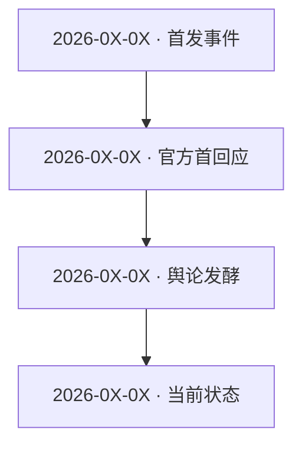

# 事件报告：<事件简称>

<!-- 封面图：优先用采集中最代表性的实拍/截图；无合适图时 picsum.photos（seed=slug-timestamp） -->

> 一句话概览：<1-2 句——发生了什么、当前状态、最关键的不确定/争议>

---

## 一、事件核验

> 是否真实存在、首发时间与来源、辟谣状态。这一节是"这份报告能不能成立"的前提。

- **真实存在**：<是/否/部分；依据哪些权威或一手来源确认>
- **首发**：<首发时间、首发来源/平台>
- **消歧**：<若同名事件多，说明确认的是哪一件；无歧义写 n/a>
- **辟谣状态**：<未被辟谣 / 已被权威辟谣（出处）/ 仅见于未证实来源——疑似谣言>

---

## 二、背景与核心事实（5W1H）

客观陈述发生了什么，每条事实指向来源；读不清的标 `(uncertain)`。
<!-- 如有事件现场/产品截图/数据图，嵌入此处增加直观感；每张配事实性 caption + 来源；无图不硬凑 -->

- **Who**：<涉事主体/当事人>
- **What**：<发生了什么>
- **When**：<时间>
- **Where**：<地点/平台>
- **Why**：<起因/动机（已知才写，推测标"评估："）>
- **How**：<经过/机制>
- **核心事实清单**：逐条列关键事实，每条尽量带来源链接（引用来源索引 `[序号]`）

---

## 三、时间线

事件有发展过程的用 mermaid 或表格画；一次性事件写 n/a 并说明。

图下附 2-3 句解读：起点 → 关键转折 → 当前状态。

---

## 四、各方反应（模块化分析）

每节先一段概述该方立场/倾向，再列代表性观点（带出处）与可信度。

### 4.1 官方（宣传方式 + 答复）
<!-- 如有官方公告/声明/发布会 PPT 截图，嵌入此处（配事实性 caption + 来源） -->
- 宣传方式：<怎么包装、主打话术、投放渠道>
- 官方答复：<声明/致歉/整改承诺，带链接>
- 口径变化：<不同时间点说法是否一致>

### 4.2 权威媒体
- 核实性报道要点：<被证实的事实、关键数字>
- 首发来源：<追到一手报道>

### 4.3 社交平台 / 社区（用户评价）
- 舆论分布：<正/中/负大致比例与样本感>
- 争议焦点：<大家在吵什么>
- 代表观点：<每方 1-2 条高赞引述，注出处>

### 4.4 用户评价（真实使用者）
- 评分 / 反馈分布：<评分、典型好评/差评点>
- 投诉集中：<集中问题>（视事件类型，无则 n/a）

### 4.5 垂直专业 / KOL
- 行业视角：<业内人士/分析师怎么看>
- 利益相关标注：<恰饭/代言嫌疑>

---

## 五、模块化分析

### 5.1 影响与受众
<波及谁、影响面、量级。评估性，用"评估："前缀。>

### 5.2 争议与风险
<核心争议点、各方分歧、潜在风险（法律/商业/信任）。>

### 5.3 对比与脉络
<与同类事件/产品/历史对比，帮助读者定位。无则 n/a。>

---

## 六、信息缺口与不确定

诚实列出没读清、未证实、信源冲突的地方——uncertain 汇总，让读者知道报告的边界。

- <缺口/不确定 1>
- <缺口/不确定 2>

---

## 七、信息来源索引（信源可信度分级）

按 `references/platforms.md` 的分级表标注。序号供正文 `[序号]` 引用。

| # | 来源 | 类型/等级 | 链接 | 一句话内容 |
|---|------|----------|------|-----------|
| 1 | <来源名> | 一手/官方 | <url> | <> |
| 2 | <来源名> | 权威媒体 | <url> | <> |
| 3 | <来源名> | 社区/KOL | <url> | <> |

---

> 作者：lusca
> 版本：lusca-news-report v<version>
> 出处：https://github.com/yjmm10/lusca-skill/tree/main/skills/lusca-news-report

<!-- ============================================================ -->
<!-- 自查清单（落盘前过一遍）-->
<!-- ============================================================ -->
<!-- [ ] 事件核验完成：真实存在已确认、消歧已确认、辟谣状态已查（疑似谣言已标注） -->
<!-- [ ] 核心事实均指向来源，未编造；读不清的标 (uncertain) -->
<!-- [ ] 区分了事实（1-4 节）与评估（5 节，"评估："前缀） -->
<!-- [ ] 多平台采集按事件类型裁剪，已说明扫了/没扫哪些渠道 -->
<!-- [ ] 官方宣传与事实分开记，冲突处并列标可信度 -->
<!-- [ ] 用户评价给了分布而非单挑极端 -->
<!-- [ ] 时间线（若有发展）已画 mermaid/表格 + 解读 -->
<!-- [ ] 信息缺口与 uncertain 已汇总 -->
<!-- [ ] 来源索引含可信度分级 -->
<!-- [ ] 关键图片已采集并嵌入（官方截图/数据图/事件照），配事实性 caption；无图节不硬凑；封面图就位 -->
<!-- [ ] 段落一段一行（不句中折行）；并列 ≥3 已列表化 -->
<!-- [ ] frontmatter 齐全 + 文末三行出处块 -->
