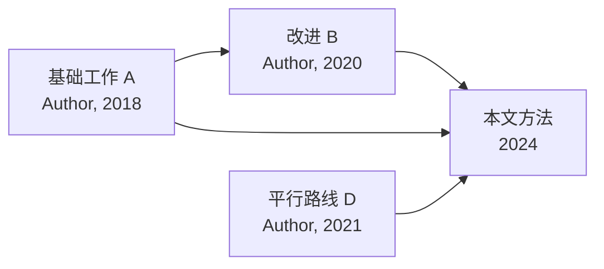
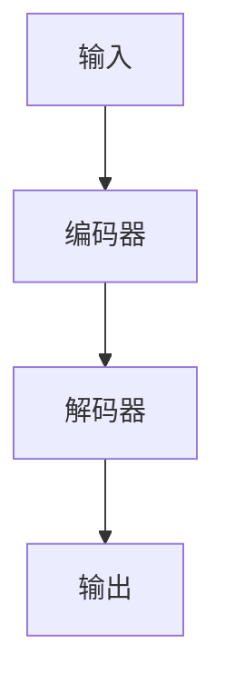

<!-- 阅读笔记模板 — lusca-paper-read 生成时参照本模板逐节填写 -->
<!-- 元信息只在 frontmatter；正文从 TL;DR 开始 -->
<!-- 填写规范：[...] 替换为实际内容；无内容写 n/a 并说明；不确定标 (uncertain) -->
<!-- 论文解读（TL;DR 至关键结果）饱满不可简化；批判性评估为自然叙述（六维+五视角仅作内化指导） -->

# 阅读笔记：<论文标题>

## TL;DR

<!-- 2–3 句，可独立传播：用什么方法解决了什么问题，核心结论是什么，主要 caveat 是什么 -->
这篇论文用 **[方法]** 解决了 **[问题]**。核心结论是 **[claim]**，关键证据是
**[最支撑结论的一条证据]**。主要 caveat：**[最重要的保留意见]**。

## 1. 研究内容

<!-- 论文在研究什么、贡献是什么、处于相关工作发展的什么位置 -->

### 1.1 研究问题与动机

- **研究问题**：用一句话写"这篇想回答 X"——[...]
- **动机 / 为什么重要**：[...]
- **领域定位**：[理论方向 / 应用方向；上下游工作]

### 1.2 核心贡献

<!-- 1–3 点，每点一句话；区分"增量改进"与"新范式" -->
1. [...]
2. [...]
3. [...]

### 1.3 相关工作脉络

<!-- 用流程图展示相关工作如何发展到本文。节点标"工作 + 作者年份"，箭头表示发展/启发关系；
     本文方法作为终点突出。图下补一两句关键传承与分歧。若相关工作中断/无明确前身，改为文字说明。 -->

- **关键传承**：[A→B→C 主线传承了什么]
- **分歧**：[本文与 D 等平行路线的差异]

## 2. 方法概要

<!-- 饱满：方法路线、关键步骤、关键假设、数据/实验设置 -->
- **方法路线**：[理论 / 实验 / 系统 / 调研]
- **关键步骤**：[...]
- **关键假设**：
  - 显式：[...]
  - 隐式（读者识别）：[...]
- **数据 / 实验设置**：[数据来源、规模、baseline、指标、训练/测试划分]

### 2.1 架构图

<!-- 用 mermaid 重绘简化架构，帮助快速回忆方法结构（求快速回忆、不求精确还原）。
     若论文来自 arXiv HTML 等有图 URL 的来源，可另附原图链接。 -->

（原图：[Figure 1](图URL) — 若可获取）

## 3. 关键结果

<!-- 饱满：主要发现、证据强度、最支撑结论的证据 -->
- **主要发现**：[...]
- **证据强度**：[效应量 / 置信区间 / 重复次数；区分统计显著与实际显著]
- **最支撑结论的一条证据**：[...]

### 3.1 关键结果图

<!-- 引用论文中最支撑结论的实验图/表。图有 URL（如 arXiv HTML）则嵌入；仅有 PDF 则用
     markdown 表格重现关键数据 + 标注"见原文 Figure/Table X"。挑 1–2 张最关键的，不求全。 -->

- **该图展示**：[什么实验 / 对比 / 指标]
- **读图要点**：[最该注意的趋势 / 拐点 / 对比]

## 4. 批判性评估与价值

<!-- 合并批判性评估 + Limitations/复现性 + 可复用/后续，分三个小点。
     4.1 是自然叙述（六维+五视角作内化指导，不对号入座）；4.2/4.3 每条一行精简。 -->

### 4.1 批判性评估

<!-- 围绕核心 claim 是否站得住、证据是否够强、方法是否有利偏差、论证链是否完整、
     贡献定位是否如实，把最值得说的几点讲透。不贴框架标签；若反方论证有力可单独引出。 -->

[批判性叙述]

**综合可信度**：[高/中/低] —— [一句话理由]

### 4.2 Limitations 与复现性

<!-- 每条一行，不展开 -->
- **论文自承**：[...]
- **读者发现**：[...]
- **复现性**：代码 [是/否] · 数据 [是/否] · 超参 [是/否] · (uncertain) [未读清处]

### 4.3 可复用与后续

<!-- 每条一行 -->
- **可借鉴**：[方法/组件/数据/idea]
- **引用场景**：[何时引用此文]；BibTeX key 候选 [作者年份关键词]
- **下一步**：[ ] [action]

## Verdict

**[推荐深读 / 选读 / 跳过]** — [一句理由]
