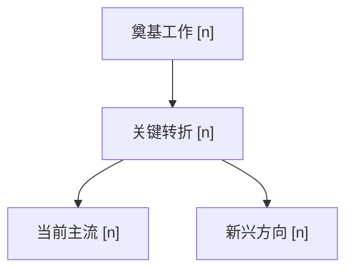

# 文献检索报告：<QUERY 简述>

> 年份 `<START>`–`<END>`，命中 `<K>` 个来源；跨源去重后 **<M>** 篇，全部列于下方索引表，请扫览确认无遗漏。

---

## 一、研究导览

> 依据脚本 `===DATA===` 段（含完整 abstract / citation_count）分析；论文引用用索引表 `[序号]`。

### 1. 技术发展脉络

起点（奠基 [n]）→ 关键转折 → 当前主流 → 新兴方向；主导会议、引用量级随时间的变化。三五句，克制不展开单篇。

### 2. 研究热点

| Theme | 描述 | 代表论文 | 趋势 | counts |
|-------|------|---------|------|--------|
| 热点 A | 一行描述 | [1][3] | ↑ | 6 |
| 热点 B | 一行描述 | [5][8] | → | 4 |
| 热点 C | 一行描述 | [2] | ↓ | 2 |

### 3. 推荐阅读

按奠基 → 最新排序的 3–5 篇，每篇一行理由（结合相关度 / `citation_count` / 会议声望）：

- **[n]** Title —— 一行理由
- **[n]** Title —— 一行理由

---

## 二、完整索引

> 脚本 `===TABLE===` 段原样粘贴；7 列，序号与导览引用一一对应。

| # | Title | Author | Date | Venue | Code/Resource | Source |
|---|-------|--------|------|-------|---------------|--------|
| 1 | [Title](url) | A, B et al. | 2024-03 | NeurIPS | [code](github url) | arxiv, semantic_scholar |
| 2 | [Title](url) | C | 2023-11 | ICLR | — | openreview |

---

## 附录：model_knowledge 补充候选

> CLI 无此数据；AI 从训练数据回忆，与 API 结果去重，可疑条目标 `(uncertain — verify)`。不足可少给或不给。

| Title | 主要作者 | Year | Venue | 一行相关性理由 |
|-------|---------|------|-------|---------------|
| [Title](https://scholar.google.com/scholar?q=Title) | Jane Doe | 2018 | NeurIPS | 奠基性；常被近期 X 工作引用 |

---

> 作者：lusca ｜ 版本：lusca-paper-search v<version> ｜ 出处：https://github.com/yjmm10/lusca-skill/tree/main/skills/lusca-paper-search
